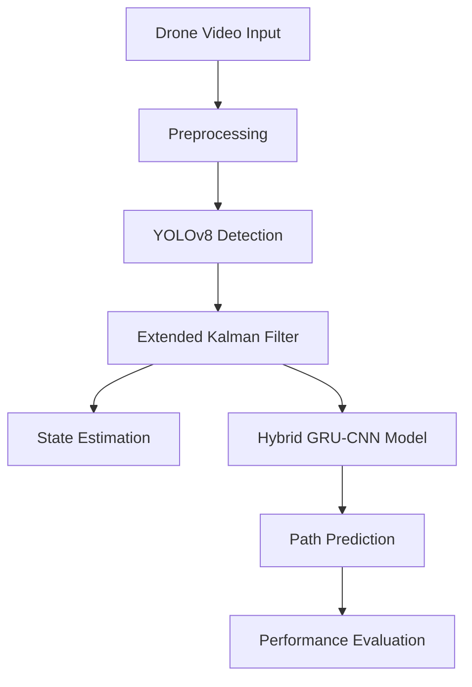

# 🚁 PrediFly - YOLO-Kalman-GRU Pipeline for Drone Detection & Prediction

<div align="center">
  


[](https://www.python.org/)
[](https://opencv.org/)
[](https://www.tensorflow.org/)
[](https://pytorch.org/)

</div>

## 📝 Description

PrediFly is an advanced drone detection and path prediction system that combines YOLO object detection, Extended Kalman Filtering for state estimation, and GRU-CNN hybrid neural networks for trajectory prediction. The system can detect drones in real-time video, track their movement with high precision, and predict their future path.

## ✨ Features

- 🔍 Real-time drone detection in video feeds
- 🔄 Smooth trajectory tracking with Extended Kalman Filtering
- 🧠 Path prediction using hybrid GRU-CNN ensemble models
- 📊 Comprehensive error analysis for different drone motion patterns
- 📱 Support for multiple drone types and movement patterns
- 📦 Easy integration with existing surveillance systems

## 🛠️ Technology Stack

| Category | Technologies |
|----------|-------------|
| **Programming** |  |
| **Computer Vision** |  |
| **Deep Learning** |   |
| **Data Visualization** |    |
| **Data Processing** |   |

## 🧮 Algorithms & Models

### 1️⃣ Detection & Tracking
| Algorithm | Purpose | Implementation |
|-----------|---------|----------------|
| **YOLOv8** | Real-time object detection | Detects drones in video frames with high precision |
| **Extended Kalman Filter** | State estimation & smoothing | Tracks drone position, velocity, and acceleration |
| **Non-Maximum Suppression** | Multiple detection handling | Removes duplicate bounding boxes |

### 2️⃣ Path Prediction
| Algorithm | Purpose | Implementation |
|-----------|---------|----------------|
| **Bidirectional GRU** | Temporal sequence modeling | Processes drone trajectory history |
| **1D CNN** | Feature extraction | Extracts motion patterns from position data |
| **Attention Mechanism** | Focus on relevant timesteps | Improves prediction accuracy for complex maneuvers |

## 📋 Project Pipeline



## 📊 Results

### Performance on Different Motion Types

| Motion Type | Mean Distance Error | Angular Error | RMSE | Confidence |
|-------------|---------------------|---------------|------|------------|
| Frog Jump Motion | 2123.92 px | 69.00° | 2127.05 px | 0.733 |
| Downward Motion | 2252.24 px | 101.53° | 2255.59 px | 0.838 |
| Upward Motion | 2290.33 px | 88.74° | 2291.48 px | 0.868 |

### Detection Performance

| Metric | Value |
|--------|-------|
| Average mAP (IoU=0.50:0.95) | 0.891 |
| Precision | 0.924 |
| Recall | 0.887 |
| Inference Time | 22ms per frame |


## 🚀 Getting Started

### Prerequisites
- Python 3.8+
- CUDA-compatible GPU (for real-time performance)
- Required packages: see `requirements.txt`

### Installation

```bash
# Clone the repository
git clone https://github.com/yourusername/predifly.git
cd predifly

# Create and activate virtual environment
python -m venv venv
source venv/bin/activate  # On Windows: venv\Scripts\activate

# Install dependencies
pip install -r requirements.txt

# Download pre-trained models
python download_models.py
```


## 📄 License

This project is licensed under the MIT License - see the LICENSE file for details.

## 👥 Contributors

- Mayank Mittal ([@mayank-mittal](https://github.com/mayankmittal29)) 

## 🙏 Acknowledgements

- Prof. Hari Kumar Kandanth for project guidance
- [Ultralytics](https://github.com/ultralytics/ultralytics) for YOLOv8 implementation
- [Drone Dataset Consortium](https://example.com) for providing training data
